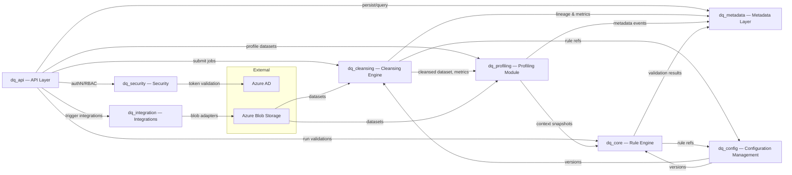

# Data Quality Assessment Platform

## What this project is about
- Central service that checks customer data files against shared business rules.
- Supports multiple customers (tenants) with different file layouts.
- Keeps full audit history so governance and compliance teams have evidence when needed.
- Designed to handle both direct file uploads and future externalised blob uploads (event, webhook, or polling trigger still pending a final decision).

## High-level architecture
The diagram below highlights how each core module collaborates, with descriptions of those modules in the section that follows.

## How the repo is organised
- `docs/` — plain-language specs and guides for product, security, and operations.
- `src/` — application code split into clear modules (API, rule engine, admin, metadata, etc.).
- `configs/` — sample configuration files, rule templates, and environment settings.
- `infra/` — deployment assets for Azure, Kubernetes, and CI/CD pipelines.
- `tests/` — automated checks to prove the platform works as expected.
- `scripts/` — helper scripts for local setup, data seeding, and maintenance.

### Key application modules
- **`src/dq_api`** — FastAPI routers, dependency wiring, and orchestration logic for cleansing, profiling, validation, and metadata persistence.
- **`src/dq_cleansing`** — Cleansing engine, rule definitions, and reporting helpers that normalise incoming data prior to validation.
- **`src/dq_profiling`** — Profiling jobs, engine, and reporting utilities that compute dataset statistics and feed rule contexts.
- **`src/dq_core`** — Rule engine, evaluator scaffolding, and models describing rules, configs, and logical fields.
- **`src/dq_config`** — Configuration loaders, validators, and registries that supply versioned rule + mapping bundles.
- **`src/dq_metadata`** — Catalog-ready metadata models, registry, and repository implementations for lineage, audit, and discovery.
- **`src/dq_integration`** — Azure Blob adapters, notification channels, and Power Platform hooks for external workflows.
- **`src/dq_security`** — Authentication providers, RBAC middleware, encryption utilities, and audit logging helpers.

## Who should read this
- Product managers tracking scope and delivery.
- Technical leads coordinating build tasks.
- Compliance or governance partners reviewing controls.

## How to get started
1. Read the Business Requirements Document (`docs/BRD.md`) for the big picture.
2. Review functional and non-functional requirements to understand what must be built.
3. Follow the docs in `infra/` and `scripts/` when you are ready to run or deploy the service.
4. If you are evaluating decoupled uploads, review `configs/external_upload.example.yaml` and the notes in `docs/ARCHITECTURE_FILE_STRUCTURE.md` for integration guidance.
