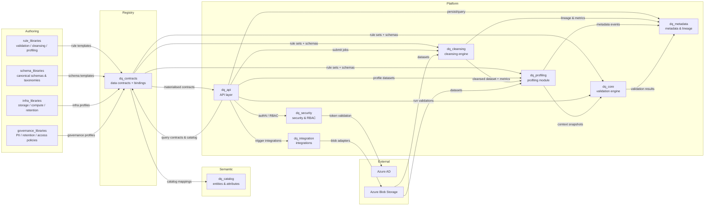

# Data Quality Assessment Platform

## What this project is about

- Central service that checks customer datasets against shared, contract-backed business rules instead of ad‑hoc spreadsheets or scripts.
- Uses explicit **data contracts** as the agreed interface between data producers and consumers, so structure, expectations, and governance are all encoded in one place.
- Supports multiple customers (tenants) with different source schemas while mapping them into a shared **semantic data catalogue** (Customer, Account, Transaction, etc.).
- Keeps full audit history so governance and compliance teams can prove which contracts, rules, and policies were in force for any run.
- Designed for both direct file uploads and future externalised blob uploads (event, webhook, or polling trigger still pending a final decision), with contracts driving validation, profiling, and downstream workflows.

## High-level architecture

The diagram below highlights how each core module collaborates, with descriptions of those modules in the section that follows.

## How the repo is organised

- `docs/` — plain-language specs and guides for product, security, and operations.
- `src/` — application code split into clear modules (API, rule engine, admin, metadata, etc.).
- `configs/` — sample configuration files and environment settings.
- `rule_libraries/` — versioned rule templates (validation, cleansing, profiling) managed as part of the contract layer.
- `infra/` — deployment assets for Azure, Kubernetes, and CI/CD pipelines.
- `tests/` — automated checks to prove the platform works as expected.
- `scripts/` — helper scripts for local setup, data seeding, and maintenance.

### Key application modules

- **`src/dq_api`** — FastAPI routers, dependency wiring, and orchestration logic for cleansing, profiling, validation, and metadata persistence.
- **`src/dq_cleansing`** — Cleansing engine, rule definitions, and reporting helpers that normalise incoming data prior to validation.
- **`src/dq_profiling`** — Profiling jobs, engine, and reporting utilities that compute dataset statistics and feed rule contexts.
- **`src/dq_core`** — Rule engine, evaluator scaffolding, and models describing rules, configs, and logical fields.
- **`src/dq_contracts`** — Data contract models and registry helpers that convert authoring inputs into database-backed schemas and rule bindings consumed by the engines.
- **`src/dq_metadata`** — Catalog-ready metadata models, registry, and repository implementations for lineage, audit, and discovery.
- **`src/dq_integration`** — Azure Blob adapters, notification channels, and Power Platform hooks for external workflows.
- **`src/dq_security`** — Authentication providers, RBAC middleware, encryption utilities, and audit logging helpers.

## Contract-driven architecture in this project

This platform is built around **contract-driven architecture**: instead of scattering schemas and rules across ad‑hoc config files, it treats them as first-class, versioned data contracts that all engines and APIs consume.

- **Centralised data contracts**

  - Dataset schemas, rule templates, and rule bindings are represented as Pydantic models in `src/dq_contracts` and stored as versioned contracts, not loose JSON/Excel files.
  - Rule libraries in `rule_libraries/` are authored in YAML/JSON and loaded into these canonical contract models.

- **Separation of concerns (but unified registry)**

  - Validation, cleansing, and profiling rules each have their own rule families and lifecycles.
  - The contract registry unifies them under a single model so engines can resolve “which rules apply to this dataset/column?” without hard-coding paths or formats.

- **Promotion and approval workflows**

  - Contracts and rule sets can be drafted, reviewed, approved, and promoted between environments (dev → test → prod).
  - Status, approver, and promotion history are captured in contract lifecycle and metadata models, mirroring real change‑control processes.

- **Auditability and lineage**

  - Every cleansing, profiling, and validation job records which contract, dataset contract version, and rule bindings were applied.
  - `src/dq_metadata` keeps an audit trail so governance teams can answer “what rules were in force?” for any historical run.

- **Extensibility without engine rewrites**

  - New rule types, datasets, or contract fields can be added by extending contract models and loaders, without refactoring the core engines.
  - Engines operate on stable, typed interfaces (contracts and rule bindings) rather than on specific file formats.

- **Multi‑tenancy by design**

  - Contracts are scoped per tenant, allowing isolation of schemas and rule sets while still sharing common templates where appropriate.
  - This supports different layouts, severities, and activation windows per tenant without duplicating engine logic.

- **Interoperability across tooling**

  - Contracts are authored in YAML/JSON, parsed into canonical Pydantic models, and then exposed as JSON via APIs and stored as JSON/JSONB where needed.
  - Cleansing, profiling, and validation engines all consume the same contract‑backed structures, ensuring rules behave consistently regardless of entrypoint.

- **Governance and compliance support**
  - Change control, rollback, and evidence packs are supported by combining contract lifecycle data with job and rule version metadata.
  - This gives compliance teams a clear view of “who changed what, when, and why” plus the ability to roll back to previously approved configurations if needed.

## Who should read this

- Product managers tracking scope and delivery.
- Technical leads coordinating build tasks.
- Compliance or governance partners reviewing controls.

## How to get started

1. Read the Business Requirements Document (`docs/BRD.md`) for the big picture.
2. Review functional and non-functional requirements to understand what must be built.
3. Follow the docs in `infra/` and `scripts/` when you are ready to run or deploy the service.
4. If you are evaluating decoupled uploads, review `configs/external_upload.example.yaml` and the notes in `docs/ARCHITECTURE_FILE_STRUCTURE.md` for integration guidance.
