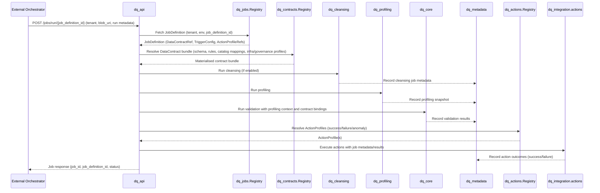

# Actions and Job Definitions — Design Overview

## 1. Purpose

- Extend the contract-driven architecture with:
  - An **Action Library** for reusable post-job behaviours (notifications, lineage events, webhooks, ticketing, storage exports, etc.).
  - **JobDefinitions/Checkpoints** for tenant-scoped orchestration of cleansing/profiling/validation runs.
- Keep DataContracts + orthogonal libraries + `dq_catalog` as the only source of truth for data semantics, rules, schemas, infra, and governance. Actions and JobDefinitions consume that truth; they never redefine it.

## 2. Key Concepts

### 2.1 ActionType

- Enumerated logical types of post-job behaviours supported by the platform (e.g., `STORE_RESULTS`, `SEND_NOTIFICATION`, `EMIT_LINEAGE`, `CALL_WEBHOOK`, `OPEN_TICKET`).
- Runtime implementations live in `dq_integration.actions` and can be extended via adapters.

### 2.2 ActionConfig

- A single action instance consisting of:
  - `action_type`: one of the supported `ActionType` values.
  - `parameters`: typed metadata for that action (channel, webhook URL, template ID, severity tag, etc.).
- Authored via YAML/JSON/Excel in `action_libraries/`, validated by loaders, and stored as canonical JSON in `dq_actions`.

### 2.3 ActionProfile

- A named, versioned bundle of `ActionConfig`s scoped by tenant and environment.
- Persisted via `dq_actions` (JSONB). Referenced from JobDefinitions (and optionally DataContracts) through `ActionProfileRef`.
- Example canonical JSON:

```json
{
  "action_profile_id": "alerts-critical-v1",
  "name": "Critical Alerts",
  "tenant_id": "TNT-001",
  "environment": "prod",
  "version": "1.0.0",
  "actions": [
    {
      "action_type": "SEND_NOTIFICATION",
      "parameters": {
        "channel": "#dq-critical",
        "template_id": "dq_job_failure_summary"
      }
    },
    {
      "action_type": "EMIT_LINEAGE",
      "parameters": {
        "target_system": "central-lineage",
        "include_payload": true
      }
    }
  ],
  "tags": ["critical", "alerts"],
  "metadata": {
    "owner": "data-platform-team"
  }
}
```

### 2.4 JobDefinition / Checkpoint

- A tenant-scoped, versioned execution plan that references an existing `DataContract` (and optional `DatasetContract`) and describes how/when to run a DQ job plus which actions to execute afterwards.
- Components:
  - `DataContractRef`: contract ID + version (and optional dataset contract ID).
  - `TriggerConfig`: `MANUAL`, `SCHEDULED`, or `EXTERNAL_EVENT`, with schedule/event metadata.
  - `ActionProfileRef`s: `on_success`, `on_failure`, `on_anomaly`.
  - Optional metadata: severity thresholds, idempotency scope, job naming hints.
- Example canonical JSON:

```json
{
  "job_definition_id": "billing-daily-checks",
  "name": "Daily Billing DQ Checks",
  "tenant_id": "TNT-001",
  "environment": "prod",
  "version": "1.0.0",
  "data_contract": {
    "contract_id": "billing-contract",
    "version": "2.1.0",
    "dataset_contract_id": "billing-dataset"
  },
  "trigger": {
    "trigger_type": "EXTERNAL_EVENT",
    "event_source": "azure_blob_event_grid",
    "event_filter": {
      "container": "billing",
      "path_pattern": "prod/inbound/*.csv"
    },
    "description": "Trigger when new billing file lands in prod inbound."
  },
  "on_success": {
    "action_profile_id": "alerts-success-v1"
  },
  "on_failure": {
    "action_profile_id": "alerts-critical-v1"
  },
  "on_anomaly": {
    "action_profile_id": "alerts-anomaly-v1"
  },
  "severity_threshold": "hard_failure_rate<0.01",
  "idempotency_scope": "per_blob_uri",
  "metadata": {
    "owner": "billing-data-team"
  },
  "status": "active"
}
```

### 2.5 Trigger

- Declarative description of how the DQ platform should be invoked:
  - `MANUAL`: invoked via explicit API call (e.g., diagnostics).
  - `SCHEDULED`: invoked on a cron-like schedule (internal or external scheduler calling the API).
  - `EXTERNAL_EVENT`: invoked when an event occurs (e.g., Azure Blob upload, queue message) via external orchestrators calling the API.

Triggers never schedule or own ETL DAGs; they simply tell external callers and job managers how to interpret invocation metadata.

## 3. Authoring and Registry Flow

1. **Action authoring**  
   Designers maintain YAML/JSON/Excel profiles in `action_libraries/`. Loader utilities validate them and convert to canonical JSON. `dq_actions` persists the profiles in JSONB tables with tenant/environment scoping.

2. **JobDefinition authoring**  
   Config teams create JobDefinitions via APIs or YAML/JSON templates. Each JobDefinition references existing contracts and ActionProfiles by ID/version. Lifecycle (draft → pending_approval → active → retired) mirrors contract promotion across environments.

## 4. Runtime Sequence

### 4.1 ETL pipeline triggers JobDefinition



## 5. Impacts on Existing Modules

- **`action_libraries/`** (authoring) mirrors other libraries; dedicated runtime registry lives in `src/dq_actions/`.
- **`src/dq_actions/`** (planned) holds Pydantic models, registry/repository, and canonical JSON persistence for ActionProfiles.
- **`src/dq_jobs/`** (planned) stores JobDefinitions/Checkpoints, referencing contracts and action profiles.
- **`src/dq_integration/actions/`** (planned) provides runtime executors that map ActionProfiles to concrete adapters (notifications, lineage, webhooks, etc.).
- **`dq_metadata`** will capture additional fields (`job_definition_id`, `action_profile_ids`, action outcomes) for auditability.
- **`dq_api`** job managers gain endpoints and services for JobDefinition CRUD and `/jobs/run/{job_definition_id}` execution.

## 6. Non-Goals

- Actions and JobDefinitions never redefine contracts, rules, schemas, infra, or governance policies.
- The platform does not become a generic ETL orchestrator. External schedulers continue to own DAGs and simply trigger JobDefinitions via APIs.

## 7. Open Questions

- Should JobDefinitions be able to reference “active” contract versions implicitly, or must they pin exact versions?
- Do we allow default ActionProfiles at contract or dataset level, or only at JobDefinition level?
- How will UI/CLI tooling expose authoring workflows for ActionProfiles and JobDefinitions to non-technical stakeholders?
