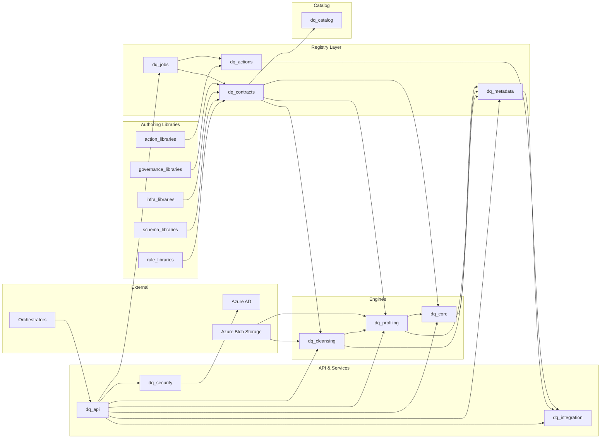

# System Architecture — Wemetrix Data Quality & Governance Platform

## 1. High-level view

- **Goal:** Validate customer data files against shared business rules while maintaining audit-ready lineage.
- **Interfaces:** FastAPI-based REST layer (`src/dq_api/`), Azure Blob Storage for file persistence, Azure AD for authentication, and optional external upload orchestrators.
- **Tenancy:** All services operate in a multi-tenant context; configuration and metadata are scoped per tenant.
- **Ground truth:** DataContracts + orthogonal libraries (`rule_libraries/`, `schema_libraries/`, `infra_libraries/`, `governance_libraries/`, `action_libraries/`) + the semantic catalog (`dq_catalog/`) are the only configuration mechanisms allowed. Everything else consumes their canonical JSON.

### 1.1 How to navigate this document

| Read this section if you need         | Key files / directories                                                                 |
| ------------------------------------- | --------------------------------------------------------------------------------------- |
| Quick map of modules to directories   | `docs/ARCHITECTURE_FILE_STRUCTURE.md`                                                   |
| Business context / requirements       | `docs/BRD.md`, `docs/FUNCTIONAL_REQUIREMENTS.md`, `docs/NON_FUNCTIONAL_REQUIREMENTS.md` |
| Contract-driven rationale             | `docs/CONTRACT_DRIVEN_ARCHITECTURE.md`                                                  |
| Metadata pillars & reporting surfaces | `docs/reference/METADATA_PILLARS.md`, `docs/reference/DQ_RULES.md`                      |
| Actions & JobDefinitions deep dive    | `docs/ACTIONS_AND_JOB_DEFINITIONS.md`                                                   |

Throughout this document, directory names are referenced in backticks so you can jump directly into the codebase when needed.

## 2. Core components

| Module                            | Directory                                                        | Responsibilities                                                        | Key docs / notes                                           |
| --------------------------------- | ---------------------------------------------------------------- | ----------------------------------------------------------------------- | ---------------------------------------------------------- |
| API layer                         | `src/dq_api/`                                                    | REST endpoints, job orchestration, RBAC wiring                          | `docs/API_CONTRACTS.md`, `docs/FUNCTIONAL_REQUIREMENTS.md` |
| Cleansing engine                  | `src/dq_cleansing/`                                              | Policy-driven transformations, chaining into profiling/validation       | `docs/diagrams/cleansing_job_flow.mmd`                     |
| Profiling module                  | `src/dq_profiling/`                                              | Profiling engine/context builder, stats exports                         | `docs/diagrams/profiling_context.mmd` (planned)            |
| Rule libraries                    | `rule_libraries/`                                                | Authoring validation/profiling/cleansing rules                          | `docs/rule_authoring.md` (planned)                         |
| Schema/Infra/Governance libraries | `schema_libraries/`, `infra_libraries/`, `governance_libraries/` | Reusable schemas, infra profiles, governance policies                   | `docs/CONTRACT_DRIVEN_ARCHITECTURE.md`                     |
| Data catalog                      | `src/dq_catalog/`                                                | Canonical entities/attributes, relationships, mapping helpers           | `src/dq_catalog/models.py`                                 |
| Data contracts                    | `src/dq_contracts/`                                              | Contract registry, canonical JSON persistence, bundling                 | `docs/CONTRACT_DRIVEN_ARCHITECTURE.md`                     |
| Rule engine                       | `src/dq_core/engine/`                                            | Evaluation of rule bindings inside profiling contexts                   | `docs/reference/DQ_RULES.md`                               |
| Metadata layer                    | `src/dq_metadata/`                                               | Lineage, audit events, profiling snapshots, reporting views             | `docs/reference/METADATA_PILLARS.md`                       |
| Integrations                      | `src/dq_integration/`                                            | Azure Blob adapters, notifications, external triggers, action executors | `docs/ARCHITECTURE_FILE_STRUCTURE.md#4.11`                 |
| Security                          | `src/dq_security/`                                               | OAuth2/Azure AD auth, RBAC, Key Vault, security logging                 | `docs/SECURITY_GUIDE.md`                                   |
| Action library (new)              | `action_libraries/`, `src/dq_actions/`                           | Reusable post-job behaviours, canonical JSON profiles                   | `docs/ACTIONS_AND_JOB_DEFINITIONS.md`                      |
| JobDefinitions (new)              | `src/dq_jobs/`                                                   | Tenant-scoped execution plans referencing contracts + actions           | `docs/ACTIONS_AND_JOB_DEFINITIONS.md`                      |

> **Tip:** For a file-by-file breakdown, always refer back to `docs/ARCHITECTURE_FILE_STRUCTURE.md`. This document highlights how the components interact.

### 2.1 Component relationships (Mermaid)

- **API Layer (`dq_api/`):** Routes for uploads, validation status, rule library/contract management, tenants, and admin tooling. Future `external_uploads` endpoint will accept blob references from external upload services.
- **Cleansing Engine (`dq_cleansing/`):** Orchestrates optional-but-recommended cleansing pipelines that standardize formats, deduplicate records, resolve survivorship, and impute or quarantine missing values. The cleansing job manager stores the cleansed dataset plus rejection set so profiling and validation can operate on a normalized input without rereading the raw blob.
- **Profiling Module (`dq_profiling/`):** Owns profiling job models, snapshot builders, and helpers that convert cleansing outputs into profiling-driven validation contexts. Provides a dedicated `ProfilingEngine`, context builder, and API placeholders so profiling can evolve independently from rule execution.
- **Rule Libraries (`rule_libraries/`):** Authoring layer where validation/profiling/cleansing rule catalogs and mapping templates live in YAML/JSON/Excel; loaders validate structure and emit Pydantic models plus canonical JSON for downstream registry use.
- **Schema/Infra/Governance Libraries (`schema_libraries/`, `infra_libraries/`, `governance_libraries/`):** Authoring layers for reusable schemas/taxonomies, infra profiles (storage/compute/retention), and governance policies (PII classifications, retention/access). Each will mirror the rule library pattern: author in YAML/JSON/Excel, validate, emit canonical JSON.
- **Data Catalog (`dq_catalog/`):** Semantic layer defining canonical entities/attributes and relationships. Contracts map producer-specific fields to these catalog attributes so rules/governance can be authored once and reused across feeds.
- **Data Contract Layer (`dq_contracts/`):** Registry layer that persists canonical contracts, datasets, rule templates, bindings, and now references to schema/infra/governance profiles and catalog mappings into Postgres (JSONB), exposing materialized bundles to engines and APIs.
- **Rule Engine (`dq_core/engine/`):** Builds profiling-driven validation contexts (via `dq_profiling`) before executing rules and emitting metadata events. When invoked for contract-driven jobs it pulls dataset contracts and binding definitions from `dq_contracts` instead of ad-hoc configs.
- **Metadata Layer (`dq_metadata/`):** Persists job lineage, profiling context snapshots, rule versions, and audit events. Provides querying interfaces used by dashboards and compliance exports.
- **Integrations (`dq_integration/`):** Adapters for Azure Blob Storage, Power Platform, and notifications. `azure_blob/external_triggers.py` is reserved for event/webhook/polling helpers once orchestration decisions are final.
- **Security (`dq_security/`):** Handles Azure AD auth, RBAC middleware, secret management via Key Vault, and audit logging.

### 2.2 Cleansing engine interaction model

- The **cleansing job manager** (`dq_api/services/cleansing_job_manager.py`) decides whether a job requires cleansing based on tenant policy, dataset type, or explicit upload flags, then invokes `dq_cleansing.engine.cleansing_engine.CleansingEngine`.
- The **cleansing engine** executes policy-ordered transformations (normalization, deduplication, survivorship, enrichment) and emits both the cleansed dataset pointer and cleansing metrics (record counts, rejected rows, transformation deltas).
- **Profiling workers** ingest the cleansed dataset (not the raw upload) to ensure statistics reflect the curated state that validation rules will inspect.
- The **validation rule engine** receives explicit references to the cleansed dataset, the applied cleansing rule version, and profiling outputs so failures can cite whether they stem from residual data issues or rule violations.
- **Metadata registry** links the raw upload, cleansing job, profiling snapshot, and validation job IDs. Diagrams `docs/diagrams/cleansing_job_flow.mmd` and `docs/diagrams/cleansing_validation_chain.mmd` visualise these interactions.

### 2.3 Profiling module structure

- **`dq_profiling/models/`:** Pydantic models for profiling jobs, job results, and profiling snapshots (per-field stats plus overrides).
- **`dq_profiling/engine/`:** `ProfilingEngine` produces snapshots from datasets; `ProfilingContextBuilder` normalizes snapshots so the rule engine can consume them consistently.
- **`dq_profiling/api/`:** Placeholder router that will expose profiling endpoints once the REST layer is ready.
- **`dq_profiling/report/`:** `ProfilingReport` converts `ProfilingJobResult` snapshots into export-friendly structures (dict/CSV) so APIs and downstream consumers can surface profiling metrics (counts, min/max/mean/stddev, frequent values, numeric histograms, categorical distributions) without reprocessing datasets.
- **Integration points:** `dq_core.engine.helpers` now delegates to `dq_profiling` for building contexts, and metadata specs reference profiling context IDs originating from this module.

Profiling outputs now include per-attribute statistics (row counts, distinct counts, null counts), descriptive metrics (min, max, mean, standard deviation where numeric), top-N frequent values with percentages, and distribution summaries (histograms for numeric data and full value counts for categorical data). These enriched metrics power adaptive validation thresholds, metadata insights, and reporting experiences.

### 2.4 Data contract layer

- **`dq_contracts/models.py`:** Defines `DataContract`, `DatasetContract`, `ColumnContract`, `RuleTemplate`, `RuleBinding`, and lifecycle metadata (status, approvals, promotions, schema registry references). Contracts are scoped by tenant and environment and expose helper methods for resolving dataset schemas, rule bindings, and rule template catalogs.
- **`dq_contracts/loader.py` (planned):** Parses YAML/JSON contract files stored under `configs/contracts/`, validates references (logical fields, rule templates), normalizes IDs, and emits strongly typed contract models ready for persistence.
- **`dq_contracts/registry.py`:** Coordinates persistence and retrieval of contracts, dataset contracts, rule templates, and rule bindings via the repository layer. Provides high-level methods for registering contracts, promoting versions across environments, enumerating dataset schemas, and supplying contract-aware rule bundles to the cleansing/validation engines.
- **`dq_contracts/repository.py`:** Implements the storage abstraction (SQLAlchemy/Postgres) and is invoked by migration scripts under `scripts/migrations/` plus CLI utilities like `scripts/sync_contracts.py`.
- **Integration points:** Job managers in `dq_api.services` query the ContractRegistry to determine which dataset contract/rule bindings apply to a validation or cleansing job. Engines consume the resolved dataset schema and compiled rule set, while `dq_metadata` receives explicit contract IDs, dataset contract IDs, and binding IDs for lineage.

Contract-driven orchestration ensures that rules, schemas, and lifecycle metadata flow through a single source of truth rather than ad-hoc config bundles. It also enables bidirectional sync (filesystem ↔ API ↔ DB), environment promotion workflows, and future streaming integrations (schema registry subjects) described in `docs/CONTRACT_DRIVEN_ARCHITECTURE.md`.

**Canonical JSON guarantee:** Regardless of authoring format (YAML/JSON/Excel), all rule templates and contracts are normalised into canonical JSON via `dq_contracts.serialization.to_canonical_json` (or the mirrored helper in `rule_libraries.loader`) before being stored in Postgres JSONB columns, returned by APIs, or forwarded to engines/metadata exports.

### 2.5 Composed contracts (libraries + catalog)

- **Orthogonal libraries:** Rules (`rule_libraries`), schemas (`schema_libraries`), infra profiles (`infra_libraries`), and governance profiles (`governance_libraries`) are authored separately and versioned independently. Each emits canonical JSON via library loaders.
- **Semantic catalog:** `dq_catalog` defines canonical entities/attributes/relationships. Contracts map producer fields to catalog attributes so rules/governance authored at the catalog level can be reused across feeds.
- **Contract composition:** `DataContract` holds references (`SchemaRef`, `RuleSetRef`, `InfraProfileRef`, `GovernanceProfileRef`) plus catalog mappings (`catalog_entity_id` on datasets, `catalog_attribute_id` on columns). At runtime the registry materialises a bundle with resolved schema/rules/infra/governance profiles and catalog mappings for engines and IaC to consume.

## 3. Upload pathways

- **Direct uploads (current):** Clients submit files via `/uploads`. Job manager stores raw files, triggers profiling, runs validations, and records results.
- **Decoupled uploads (future):** External service writes to Azure Blob and signals the DQ API by event, webhook, or polling (decision pending). The payload contains blob URI, ETag, tenant metadata, and optional profiling overrides. The API enqueues the job through `external_trigger_service.py` once implemented.
- **Metadata impact:** Every job records `ingestion_mode`, blob references, and trigger metadata so auditors can trace the file’s origin.

## 4. Data & control flow (summary)

1. **Ingestion:** Either direct upload or external trigger registers a validation job.
2. **Contract resolution:** Job manager queries `dq_contracts.ContractRegistry` (scoped by tenant/environment/dataset type) to determine the dataset contract, schema expectations, and rule bindings that must drive subsequent steps. Contract identifiers are stamped onto the job metadata to ensure lineage.
3. **Cleansing (policy-driven):** Cleansing engine removes duplicates, standardizes formats, enriches or quarantines missing values, and stages rejection sets. Output URIs and metrics are persisted so downstream steps can cite the exact cleansing version applied.
4. **Profiling:** Workers analyse the cleansed dataset to produce metrics that drive dynamic thresholds. Profiling events record whether cleansing occurred plus key before/after deltas for audit.
5. **Validation:** Rule engine executes all active bindings supplied by the ContractRegistry inside the profiling-driven context, referencing cleansing outputs for lineage and optional remediation hints.
6. **Reporting:** Results flow to report services for download/export and to notification channels, combining cleansing and validation summaries when both were executed.
7. **Lineage:** Metadata registry links blob assets, cleansing rule versions, contract IDs, dataset contract IDs, profiling context, validation outcomes, and notification events for every run.

Refer to workflow diagrams in `docs/diagrams/*.mmd` for sequence details

## 5. Governance & observability

- **Audit readiness:** Every configuration change, upload event, and rule execution is logged with correlation IDs.
- **Compliance tooling:** Metadata exports support evidence packs and dashboards; external ingestion views surface blob-specific lineage.
- **Monitoring:** Health endpoints, structured logging, and future telemetry hooks (e.g., queue lag) feed platform observability.

## 6. Actions & Job Definitions

### 6.1 Action Library

- Introduces an **Action Library** (authored in `action_libraries/`) for reusable post-job behaviours (notifications, lineage events, webhooks, ticketing, storage exports, etc.).
- Authoring mirrors other orthogonal libraries: YAML/JSON/Excel sources → validated loaders → canonical JSON persisted via a runtime registry (`src/dq_actions/`) in Postgres JSONB.
- ActionProfiles never redefine data semantics or rules; they are only referenced after jobs complete so that `dq_integration` adapters can run consistent side effects across tenants and environments.

### 6.2 JobDefinitions / Checkpoints

- A **JobDefinition** (or Checkpoint) is a tenant-scoped, versioned resource stored in `src/dq_jobs/` that describes how to run a DQ job using an existing `DataContract`.
- Each JobDefinition references a `DataContract` (and optional `DatasetContract`) via IDs/versions, declares trigger semantics (manual API call, scheduled, external event), and attaches `ActionProfileRef`s for on-success/on-failure/on-anomaly behaviours.
- JobDefinitions do **not** own ETL DAGs or embed rules/schemas; external orchestrators (Airflow, ADF, etc.) call APIs such as `/jobs/run/{job_definition_id}` and provide dataset/batch references (e.g., blob URIs). The DQ platform resolves contracts via `dq_contracts`, runs cleansing/profiling/validation, records metadata, and then executes actions.
- Lifecycle and promotion mirror DataContracts: JobDefinitions are multi-tenant, environment-aware, and reference only contracts/profiles that exist in the same environment.

This extension keeps DataContracts + orthogonal libraries + catalog as the only ground truth for data semantics and rules while adding a consistent orchestration layer for job execution and post-job actions.

## 7. Security, Privacy, and Compliance Reference

The security posture spans across modules but is centralised in `src/dq_security/` and documented in `docs/SECURITY_GUIDE.md`. Key expectations:

- **Authentication & RBAC:** Azure AD (OAuth 2.0 / OpenID Connect) via `dq_security/auth_provider.py`, enforced in `dq_api` middleware. Tenant + environment claims are validated on every call.
- **Secret management:** Azure Key Vault integration used by API, cleansing workers, and integrations. Configuration patterns live in `infra/azure/keyvault-*`.
- **Compliance tagging:** Governance profiles (from `governance_libraries/`) feed into contracts and metadata to ensure PII/retention/access policies drive cleansing, validation, storage, and action execution.
- **Audit logging:** `dq_metadata` persists every privileged change (contracts, job definitions, action profiles) with correlation IDs. `dq_security/audit_logger.py` mirrors events into Azure Monitor/Sentinel for SOC integration.
- **Data isolation:** Every persisted object (contracts, job defs, metadata records, action profiles) carries tenant + environment scope. Shared services must never mix tenants in the same storage container or queue.

Refer to `docs/BRD.md` (sections 8–11) and `docs/NON_FUNCTIONAL_REQUIREMENTS.md` for detailed security and compliance requirements.

## 8. Testing, Deployment, and Operations

- **Testing:**
  - Unit tests live under `tests/unit/` (rule loaders, registry logic, API behaviour).
  - Integration tests live under `tests/integration/` (end-to-end upload → contract resolution → cleansing/profiling/validation).
  - Regression tests (future) will use `tests/regression/` once the `dq_tests/` harness is implemented.
  - Action/JobDefinition scenarios should include simulation tests that assert canonical JSON round-trips, registry lookup, and job manager wiring (`docs/ACTIONS_AND_JOB_DEFINITIONS.md` outlines examples).
- **Deployment:**
  - Infrastructure-as-code templates live in `infra/` (Dockerfiles, Kubernetes manifests, CI/CD pipelines).
  - Promotion follows dev → test → prod with contracts, job definitions, and action profiles promoted via registries.
  - External orchestrators (Airflow, ADF) call APIs; they remain outside this repo but must integrate with `/jobs/run/{job_definition_id}` and `/uploads`.
  - Observability hooks (logging, metrics, tracing) should be configured via `infra/ci_cd/*` and `docs/ARCHITECTURE_FILE_STRUCTURE.md#infra`.
- **Operations:**
  - Job managers emit metrics to `dq_metadata` and optional telemetry sinks (queue depth, run durations, action outcomes).
  - Action execution failures must be surfaced via alerts (ActionProfiles can point to fallback notifications).

## 9. Pending decisions & next steps

- **Upload orchestration:** Need to confirm whether Event Grid, direct webhook callbacks, or polling will be used for external uploads. Placeholder services/configs (`external_uploads.py`, `external_trigger_service.py`, `external_upload.example.yaml`) remain ready.
- **Profiling pipeline hardening:** Profiling workers must be wired to emit context snapshots and thresholds before production launch.
- **Integration roadmap:** Once orchestration is chosen, implement Azure event handlers or schedulers in `azure_blob/external_triggers.py` and update API contracts accordingly.

For a detailed file-by-file breakdown, see `docs/ARCHITECTURE_FILE_STRUCTURE.md`. Business and functional requirements live in `docs/BRD.md` and `docs/FUNCTIONAL_REQUIREMENTS.md`.

## 10. Extensibility & Further Reading

- For detailed sequences and pseudo-models, see `docs/ACTIONS_AND_JOB_DEFINITIONS.md`.
- Contract-driven rationale and governance principles are in `docs/CONTRACT_DRIVEN_ARCHITECTURE.md`.
- The book `docs/reference/DrivingDataQualityWithDataContracts.pdf` presents the contract-driven architecture in depth, including practical producer/consumer alignment patterns.
- Pending enhancements (profiling hardening, upload orchestration, action executor catalog) are tracked in `docs/BACKLOG.md`.
