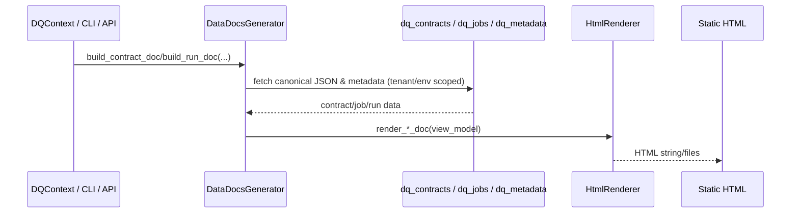

# Data Docs Strategy (`dq_docs`)

Data Docs provide tenant/environment-scoped, human-readable documentation of contracts, job definitions, and job runs. They render canonical JSON and metadata; they do **not** introduce new configuration or rules. Outputs are designed for auditors, onboarding, and evidence packs (exportable HTML/markdown).

## Views

- **ContractDoc** — Contract id/name/version, datasets, schemas (columns, constraints), catalog mappings, rule bindings/templates, governance tags, lifecycle metadata.
- **JobDefinitionDoc** — JobDefinition/Checkpoint id/name/tenant/env, dataset type, referenced contract, triggers, tags, attached ActionProfiles.
- **RunDoc** — Run/job id, job definition ref, contract/version, ingestion info (blob URI/mode), cleansing summary, profiling stats, validation results, executed actions, timestamps.
- **Optional stubs:** Rule-centric docs (where a rule template is used), ContractDiffDoc (schema/rule/governance changes between versions).

## Flow

- **Sources:** `dq_contracts` (contracts), libraries (rule/schema/infra/governance/action), `dq_jobs` (job definitions), `dq_metadata` (runs, profiling snapshots, validation results), `dq_integration` (blob URIs/action outcomes).
- **Generator:** `DataDocsGenerator` pulls from registries/stores (dependency injection) and maps to view models.
- **Renderer:** `HtmlRenderer` produces HTML strings for contract/job/run docs; suitable for static export or API responses.
- **CLI:** Stubbed in `src/dq_docs/cli.py` for future generation commands (e.g., `dqctl datadocs contract --contract-id ...`).

## Diagram



## Examples (pseudo-HTML)

- **ContractDoc**
  ```html
  <h1>Contract: billing-v1</h1>
  <p>Tenant: acme | Env: prod | Version: 1.2.0</p>
  <h2>Dataset: billing</h2>
  <ul><li>amount (decimal) required</li><li>status (string)</li></ul>
  <h3>Rules</h3>
  <ul><li>status_allowed_values (hard)</li><li>amount_positive (hard)</li></ul>
  ```
- **JobDefinitionDoc**
  ```html
  <h1>JobDefinition: billing_daily</h1>
  <p>Dataset: billing | Contract: billing-v1</p>
  <p>Triggers: scheduled 0 2 * * *</p>
  ```
- **RunDoc**
  ```html
  <h1>Run: run-123</h1>
  <p>JobDefinition: billing_daily | Contract: billing-v1</p>
  <p>Status: failed (hard)</p>
  <h3>Validation</h3>
  <ul><li>amount_positive: fail rate 2%</li></ul>
  ```

## Multi-tenancy and scope

- All docs generation must be tenant + environment aware. Either accept tenant/env explicitly or infer from the loaded contract/job/run (which must already be scoped).
- Docs must never merge data across tenants/environments.

## Roadmap / TODOs

- Wire `DataDocsGenerator` loaders to actual registries/stores (`dq_contracts`, `dq_jobs`, `dq_metadata`, `dq_actions`).
- Extend renderers with richer layouts (tables, links to blobs/runs) while keeping static export simple.
- Add API/CLI endpoints for on-demand generation per tenant/env.
- Integrate profiling charts when `dq_profiling` provides rendered snapshots.

Ground truth remains the contracts + libraries + catalog; Data Docs only render what already exists.
