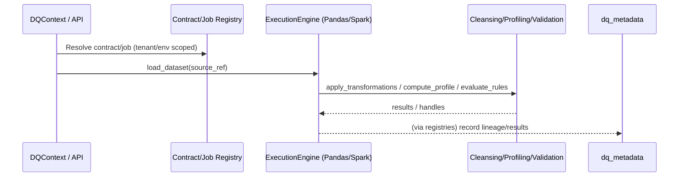

# Execution Engines (`dq_engine`)

Execution engines decouple *how* cleansing, profiling, and validation run from *what* contracts and rules require. They allow the platform to support multiple backends (Pandas today; Spark/SQL later) without changing orchestration or introducing new configuration.

## Principles

- Backend selection is driven by DataContracts and infra profiles (storage/compute hints); execution engines do **not** store configuration.
- Engines operate on dataset references already resolved in a tenant/environment-safe manner by job managers and registries.
- Interfaces stay small and focused on tabular operations needed by cleansing → profiling → validation.

## Interfaces

- `ExecutionEngine` (in `src/dq_engine/base.py`):
  - `load_dataset(source_ref)` — load from blob/table.
  - `persist_dataset(handle, target_ref)` — write dataset and return lineage ref.
  - `apply_transformations(handle, transformations)` — cleansing hooks.
  - `compute_profile(handle, spec)` — profiling stats.
  - `evaluate_rules(handle, rules_bundle)` — validation logic.
- `DatasetHandle` — opaque dataset reference (DataFrame/table/view).

## Implementations

- `PandasExecutionEngine` — default stubbed implementation; integrates with Pandas DataFrames. TODO: wire to `dq_integration` and delegate to `dq_cleansing`, `dq_profiling`, `dq_core`.
- `SparkExecutionEngine` — placeholder for Spark/SQL backends, to be selected via infra profiles.

## Sequence (high level)



## Usage (pseudo-code)

```python
from dq_engine.pandas_engine import PandasExecutionEngine
from dq_cleansing.engine.cleansing_engine import CleansingEngine

engine = PandasExecutionEngine()
cleansing = CleansingEngine(execution_engine=engine)  # defaults to pandas if omitted
```

Future work will map contract-driven infra profile hints to engine selection (e.g., Spark for large datasets). See `docs/ARCHITECTURE.md#2.8` for positioning.
