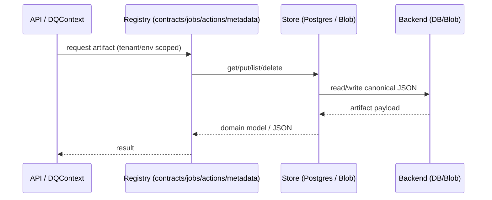

# Stores & Persistence Pattern

Stores are pluggable persistence abstractions for canonical JSON artifacts (contracts, job definitions, action profiles, job runs, reports). They let registries swap storage backends (Postgres today; filesystem/Blob later) without changing callers or introducing new configuration sources.

## Principles

- Ground truth remains **DataContracts + orthogonal libraries + semantic catalog**; stores only persist their canonical JSON forms.
- All access is tenant + environment scoped.
- Registries own domain logic; stores only handle persistence concerns.

## Store interfaces

- `ContractStore` — retrieves/persists contracts and dataset contracts; `get_latest_for_dataset(tenant, env, dataset_type)`.
- `JobDefinitionStore` — persists JobDefinitions/Checkpoints with tag filtering.
- `ActionProfileStore` — persists ActionProfiles, filterable by type.
- `JobRunStore` — persists validation/cleansing/profiling job metadata; can point to Postgres or Blob for large results.
- All derive from the generic `Store` interface in `src/dq_stores/base.py`.

## Implementations (current state)

- `postgres.py` — Adapters for Postgres-backed stores. Contract/JobDefinition/ActionProfile stores are stubbed until registries land; `PostgresJobRunStore` delegates to the existing metadata repository (file-backed by default, Postgres-ready when available).
- `blob.py` — Placeholder for Azure Blob-backed job run storage (not implemented yet).
- Registries and `DQContext` can accept these stores via dependency injection; if absent, they keep their current behaviour.

## Sequence (high level)



## Usage (pseudo-code)

```python
from dq_stores.postgres import PostgresJobRunStore
from dq_metadata.registry import MetadataRegistry

job_store = PostgresJobRunStore()  # file-backed today; Postgres later
metadata_registry = MetadataRegistry()  # unchanged consumer

# Registry can be updated later to accept `job_store` instead of a concrete repository
for job in job_store.list_by_tenant(tenant="tenant-a", environment="dev"):
    print(job.job_id, job.status)
```

For contract/job/action stores, see the stubs in `src/dq_stores/postgres.py` and the roadmap in `docs/CONTRACT_DRIVEN_ARCHITECTURE.md` and `docs/ACTIONS_AND_JOB_DEFINITIONS.md`.
